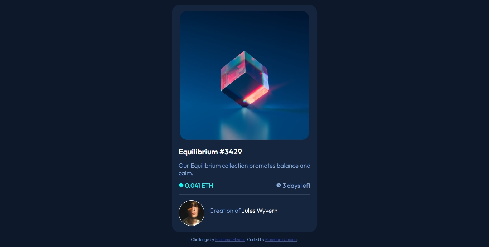

# Frontend Mentor - NFT preview card component solution

This is a solution to the [NFT preview card component challenge on Frontend Mentor](https://www.frontendmentor.io/challenges/nft-preview-card-component-SbdUL_w0U). Frontend Mentor challenges help you improve your coding skills by building realistic projects. 

## Table of contents

- [Frontend Mentor - NFT preview card component solution](#frontend-mentor---nft-preview-card-component-solution)
  - [Table of contents](#table-of-contents)
  - [Overview](#overview)
    - [The challenge](#the-challenge)
    - [Screenshot](#screenshot)
    - [Links](#links)
  - [My process](#my-process)
    - [Built with](#built-with)
    - [What I learned](#what-i-learned)
    - [Continued development](#continued-development)
    - [Useful resources](#useful-resources)
  - [Author](#author)


## Overview

### The challenge

Users should be able to:

- View the optimal layout depending on their device's screen size
- See hover states for interactive elements

### Screenshot




### Links

- [Solution URL](https://www.frontendmentor.io/solutions/nft-preview-component-built-with-flexbox-qpiPpin3J9)
- [Live Site URL](https://mmedarau.github.io/nft-preview-component/)

## My process

### Built with

- Semantic HTML5 markup
- Sass/SCSS
- Flexbox

### What I learned

I tried to challenge myself to build this project without referring to my notes and I only checked my notes once.  I am really happy about that.  
I also found out several ways to apply the hover effect on the image and how to change the color of the horizontal rule.  
This is the code snippet for changing the color of the horizontal rule
```css
hr {
  height: 2px;
  background-color: hsl(215, 32%, 27%);
  border: none;
}
```

For the hover effect on the image
```html
    <section>
      <div class="overlay"></div>
      <div class="nft-image">
        
      </div>
      ...
      </section>
```

```scss
.overlay {
  height: 25rem; //Same as image
  width: 25rem;  //Same as image
  position: absolute;

    &:hover {
      display: block;
      background-color: $hover-cyan;
      background-image: url(../images/icon-view.svg);
      background-position: center;
      background-repeat: no-repeat;
      opacity: 0.7;
      cursor: pointer;
    }
}
```

### Continued development

I'm still learning a lot. I'm currently on my Industrial Attachment and I'm grateful for the mini-break from school. I plan to use this time to finally start learning JavaScript and eventually React. I have six months so we'll see how it goes.  
I also want to start using the BEM methodology in my projects because I struggled a bit with naming classes for styling in this project.  
I feel my solution is a bit messy - the markup and the styles.


### Useful resources

Just my notes this time, but the books I used to learn are present in the [cheatsheets repository](https://github.com/MmedaraU/cheatsheets).

## Author

- Hashnode - [Mmedara Umana](https://mmedaraumana.hashnode.dev/)
- Frontend Mentor - [@MmedaraU](https://www.frontendmentor.io/profile/MmedaraU)
- Twitter - [@MmedaraUmana](https://twitter.com/MmedaraUmana)
- Github - [MmedaraU](https://github.com/MmedaraU)
